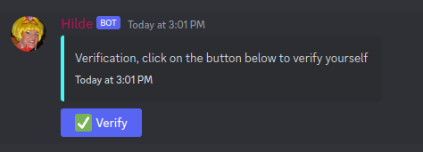

<p align="center">
  <a href="https://discord.gg/3eNaWPhWZE" target="blank"></a>
</p>

# (Simple) Verification
This guide will explain you how to create a simple verification system for your Discord.js Bot.

## Requirements
* Basic Knowledge of JavaScript/NodeJS
* Basic+ Knowledge of MongoDB/Mongoose
* Basic+ experience with NPM
* Good experience with Discord.js
* A working connection to MongoDB with Schemas

Discord.js v13 or higher.
Nodejs v16 or higher.

Understanding Pathing
```
/ = Root directory.
. = This location.
.. = Up a directory.
./ = Current directory.
../ = Parent of current directory.
../../ = Two directories backwards.
```


Now let's start coding our suggestion system.

- Setup command that sends a message with a button.
- Handling the button with an `interactionCreate` event.
- Creating our database model to save the data dynamically.

> Setup command 

Create a file called `setup.ts` in your `commands` folder.

```ts
import {
  ApplicationCommandOptionType,
  PermissionFlagsBits,
  EmbedBuilder,
  ButtonBuilder,
  ButtonStyle,
  TextChannel,
  ActionRowBuilder,
  Guild,
} from "discord.js";

// this line here is optional
import { ownerCheck } from "../../guards/owner";

import { Command } from "../../structures/Command";

// database model
import GuildModel from "../../models/guild/guild";

export default new Command({
  name: "setup",
  description: "Setup verification",
  // options for our command
  options: [
    {
      name: "role",
      description: "The role that the user should receive",
      type: ApplicationCommandOptionType.Role,
      required: true,
    },
    {
      name: "channel",
      description: "The channel to send the panel in",
      type: ApplicationCommandOptionType.Channel,
      required: false,
    },
    {
      name: "active",
      description: "Whether the verification is active or not",
      type: ApplicationCommandOptionType.Boolean,
      required: false,
    },
  ],
  run: async ({ interaction, client }) => {
    await ownerCheck(interaction);
    if (interaction.replied) return;

    // get the options of the command 
    const channel =
      interaction.options.getChannel("channel") || interaction.channel;
    const role = interaction.options.getRole("role");
    const active = interaction.options.getBoolean("active") || false;

    // find the guild in the db
    const guildQuery = await GuildModel.findOne({
      guildID: interaction.guild.id,
    });

    // if no data, create it
    if (!guildQuery) {
      await GuildModel.create({
        guildID: interaction.guild.id,
        role: role.id,
        active: active,
      });
    }

    // create an embed with a button attached to it
    const embed = new EmbedBuilder()
      .setDescription(
        "Verification, click on the button below to verify yourself"
      )
      .setColor("Random")
      .setTimestamp();

    const row = new ActionRowBuilder<ButtonBuilder>().addComponents(
      new ButtonBuilder()
        .setStyle(ButtonStyle.Primary)
        .setLabel("Verify")
        .setCustomId("verification")
        .setEmoji("✅")
    );

    // if there is data, update it to the new data
    await GuildModel.findOneAndUpdate(
      {
        guildID: interaction.guild.id,
      },
      {
        role: role.id,
        active: active,
      }
    );

    interaction.reply({
      content: `Setup successfully completed!\n\nChannel: ${channel}\nRole: ${role}\nActive: ${active}`,
      ephemeral: true,
    });

    // send the embed in the channel (with the button)
    await (channel as TextChannel).send({
      embeds: [embed],
      components: [row],
    });
  },
});
```

Cool, so now we somehow need to create the `GuildModel` model. 
For that, please create a file called `guild.ts` in your `models/guild` folder.

```ts
import { prop, getModelForClass } from "@typegoose/typegoose";

class Guild {
    @prop()
    guildID: string 

    @prop()
    role: string 

    @prop()
    active: boolean
}

const GuildModel = getModelForClass(Guild);

export default GuildModel;
```

Why do we use typegoose? Since we use typescript, we want to use the powerful and clean type-system that is built into it. And mongoose is more like for JavaScript.

> Handling the button

Now we need to handle the button. For that, we need to create a file called `verification.ts` in your `events` folder.

```ts
import { ExtendedClient } from "../structures/Client";
import { BaseEvent } from "../structures/Event";
import { ExtendedButtonInteraction } from "../typings/Command";

import GuildModel from "../models/guild/guild";

export default class InteractionCreateEvent extends BaseEvent {
  constructor() {
    super("interactionCreate");
  }
  async run(client: ExtendedClient, interaction: ExtendedButtonInteraction) {
    if (interaction.customId === "verification") {

      // find the guild in the db
      const guildQuery = await GuildModel.findOne({
        guildID: interaction.guild.id,
      });

      const member = interaction.member;
      const role = guildQuery.role;
      const active = guildQuery.active;

      // if no setup or if the verification is not active (set to false), dont do anything
      if (!guildQuery || !active) {
        return interaction.reply({
          content:
            "Verification is not active or properly setup yet. Please check back later",
          ephemeral: true,
        });
      }

      // if the user does not have the role, add it
      if (!member.roles.cache.has(role)) {
        await member.roles.add(role);
        interaction.reply({
          content: "You have been verified!",
          ephemeral: true,
        });
      }

      // if the user has the role already
      await interaction.reply({
        content: "You are already verified",
        ephemeral: true,
      });
    }
  }
}
```

Nice! So now we have to test it out. Once you have filled out the `.env` file, you can start your bot using: 

```bash
$ npm run dev
```

After a few seconds, your bot should be online. 

> Testing 

Once your bot is online, run `/setup` in your server and fill out all the required options (role, active).

<p align="center">
  <a href="https://discord.gg/3eNaWPhWZE" target="blank"></a>
</p>

Click the button and you should see the magic happening. 

🎉 You have successfully created a simple verification system using Buttons.
